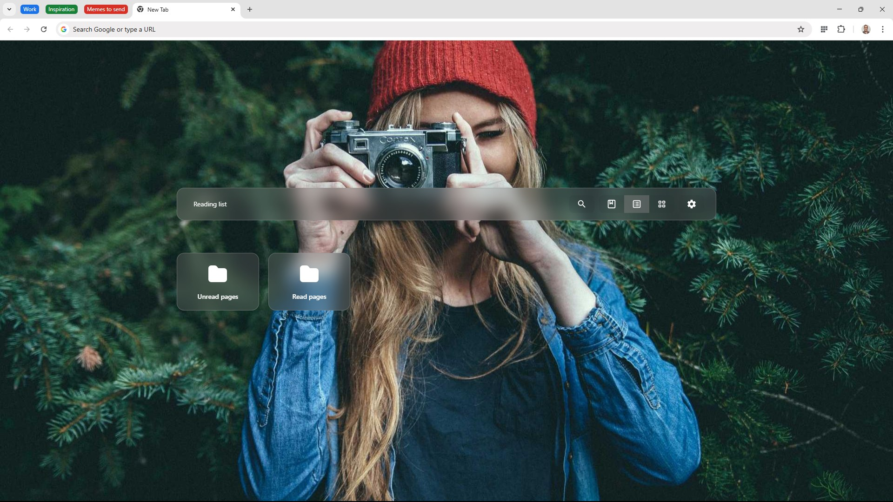

#  Quick Access

A clean, intuitive browser extension that gives you one-click access to all your bookmarks, reading lists, browsing history, and tab groups on the new tab page.

 
<table border="0">
<tr>
  <td></td>
  <td></td>
  <td></td>
  <td></td>
  <td></td>
</tr>
</table>

## Features

- Clean tiled Speed Dial-like interface
- Single side panel for quick access to everything
- Easy switch between different views, groups and folders
- Quick search across all items
- Create, modify or delete everything in one place
- Drag and drop support (rearrange, organize, pin to desktop)
- Automatic dark/light mode detection
- Custom wallpapers and wallpaper provider URLs
- Built-in favicon and custom favicon provider support
- Customizable grid layout and color themes
- Lightning fast navigation with <kbd>TAB</kbd>, <kbd>↑</kbd>, <kbd>↓</kbd>, <kbd>←</kbd> and <kbd>→</kbd> arrow keys.
- Fully localized interface (available in 36 languages)
- Fine-tuneable permissions. Only allow what you need.
- All settings are synced to your browser's account.
- Works in Firefox, Chrome, Edge, Opera, Brave, Vivaldi, ...

Thanks for trying it! ;)

This is a hobby project for myself, but let's see if it can conquer the world!

## Installation

Get it from the [Chrome Web Store](https://chromewebstore.google.com/detail/quick-access/pomnndfpgmpdpcjinlcihleaehhblchc) / [Firefox Add-ons](https://addons.mozilla.org/hu/firefox/addon/quick-access/)

-- OR -- 

1. Download the <a href="https://github.com/programmerg/quick-access/archive/refs/tags/v1.4.3.zip">latest release</a>.
2. Open your browser and go to `chrome://extensions`.
3. Enable "Developer mode".
4. Click "Load unpacked" and select the project folder.
5. Hooray, you now have your own Quick Access!

## File Structure

- `_locales/` – Translations
- `images/` – Icons, favicons
- `src/` – Modules like: Bookmark, History, Page, Permission, Settings, Tab, TopSite
- `index.html` – Main HTML page, includes UI and SVG icons
- `index.js` – UI logic: event handling, tiles, search, settings, etc.
- `index.css` – Default styles
- `manifest.json` – Extension manifest
- `service-worker.js` – Service worker, install logic

## Contributing

[Bug reports](https://github.com/programmerg/quick-access/issues), 
[improvement ideas](https://github.com/programmerg/quick-access/discussions), 
and [pull requests](https://github.com/programmerg/quick-access/pulls) are welcome!

## License

[MIT](LICENSE)
