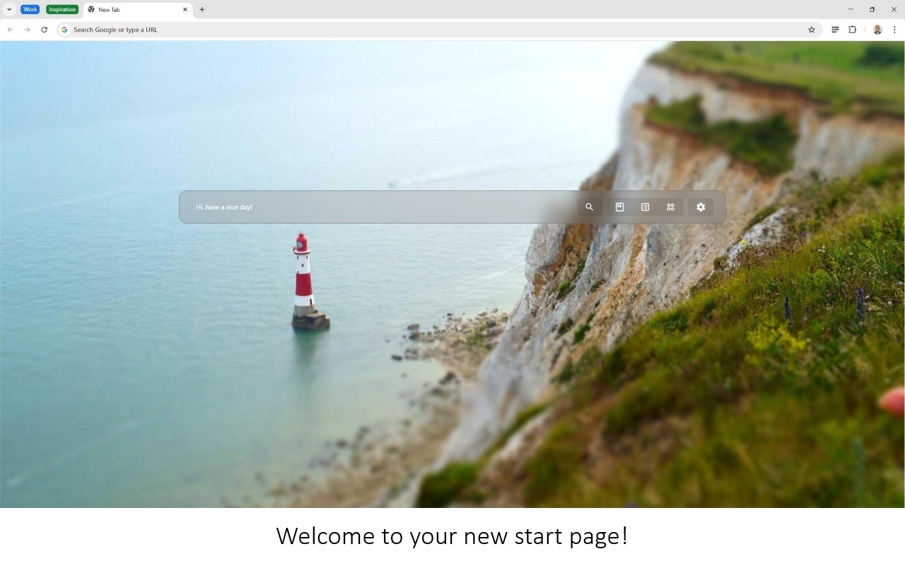
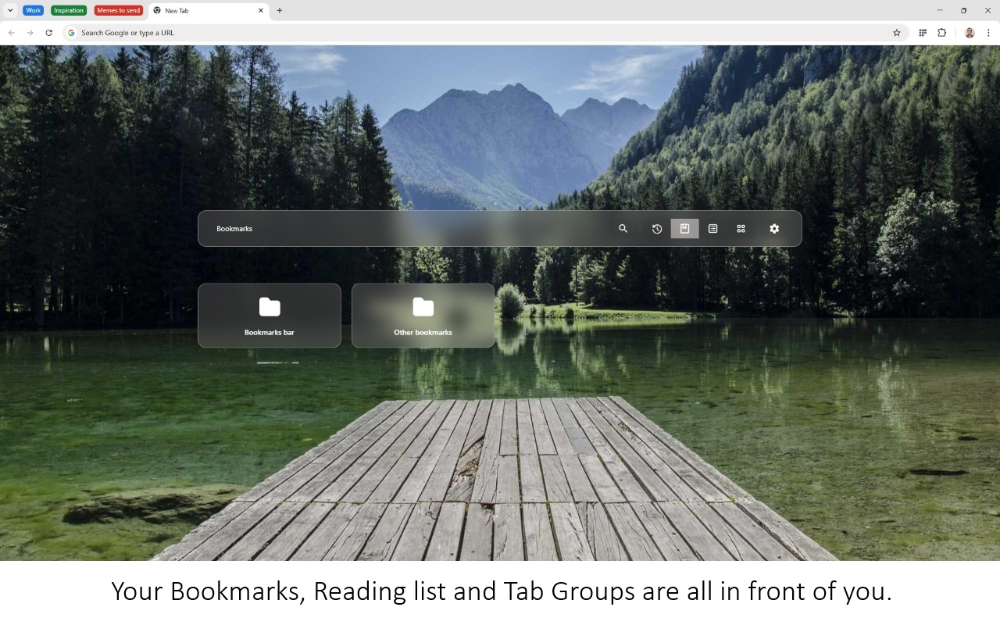
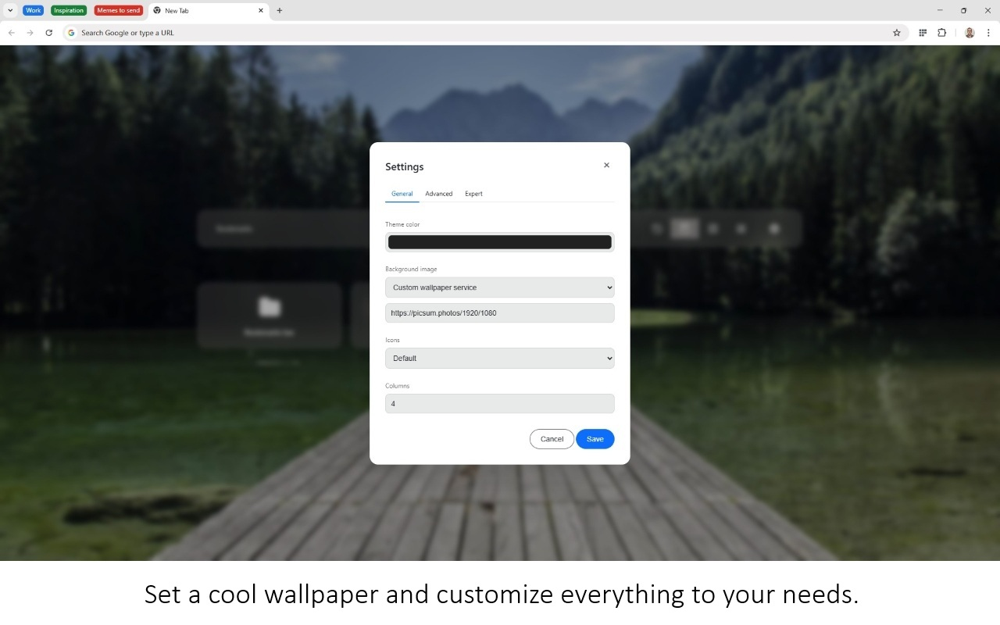
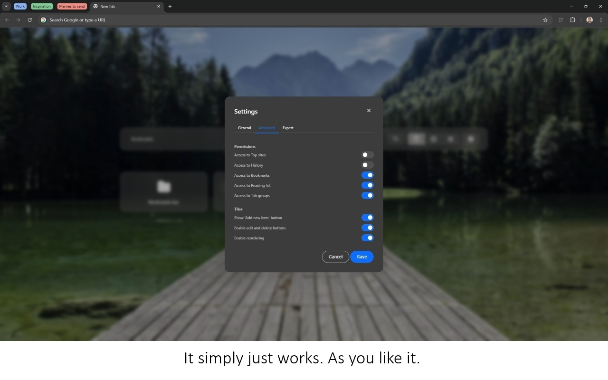
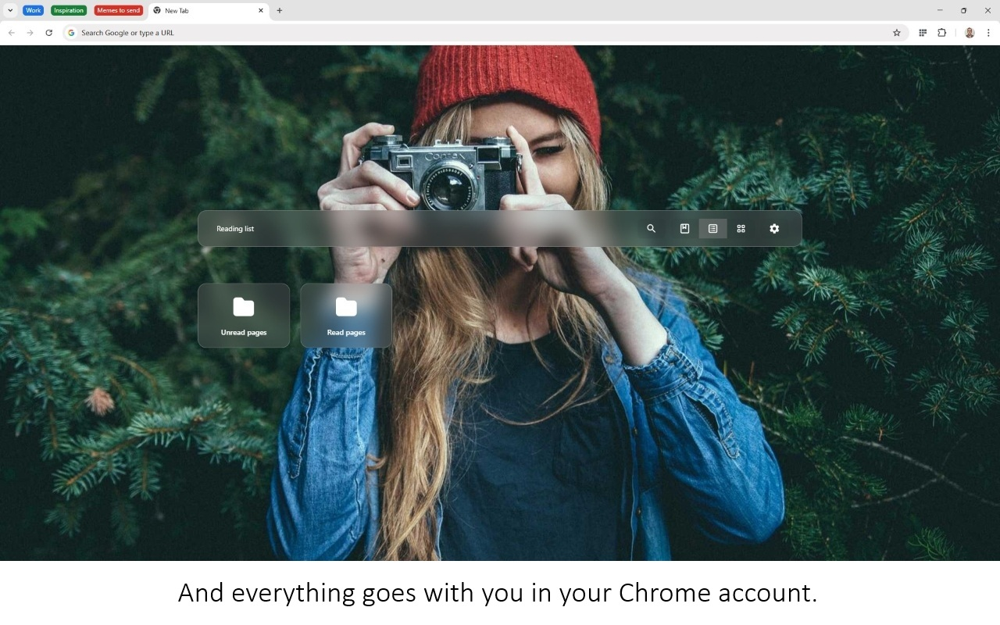

#  Quick Access

A clean, intuitive new tab page where you can access your Favorites, Reading List, and Tab Groups with just one click.

## Screenshots

<table style="width:100%">
<tr>
  <td></td>
  <td></td>
  <td></td>
  <td></td>
  <td></td>
</tr>
</table>

## Features

- Clean tiled interface on the new tab page
- Side panel for quick access
- Easy switch between history, bookmarks, reading list, and tab groups 
- Quick search across all items
- Create, modify or delete everything in one place
- Drag and drop support (rearrange, organize, pin to desktop as shortcut)
- Automatic dark/light mode detection
- Custom background image, color and background provider URL support
- Built-in favicon and custom favicon provider support
- Customizable grid layout and color themes
- Lightning fast navigation with <kbd>TAB</kbd>, <kbd>↑</kbd>, <kbd>↓</kbd>, <kbd>←</kbd> and <kbd>→</kbd> keys.
- Fully localized interface (available in 36 languages)
- Fine-tuneable permissions. Only request permissions for what you need.
- It just works. All your settings are with you in your Chrome account.
- Works in all browsers that support V3 manifest

## Installation

1. Download the <a href="https://github.com/programmerg/quick-access/archive/refs/tags/v1.4.1.zip">latest release</a>.
2. Open Chrome and go to `chrome://extensions`.
3. Enable "Developer mode".
4. Click "Load unpacked" and select the project folder.
5. Quick Access will be available on the new tab page.

## Contributing

Bug reports, ideas, and pull requests are welcome!

## License

MIT
